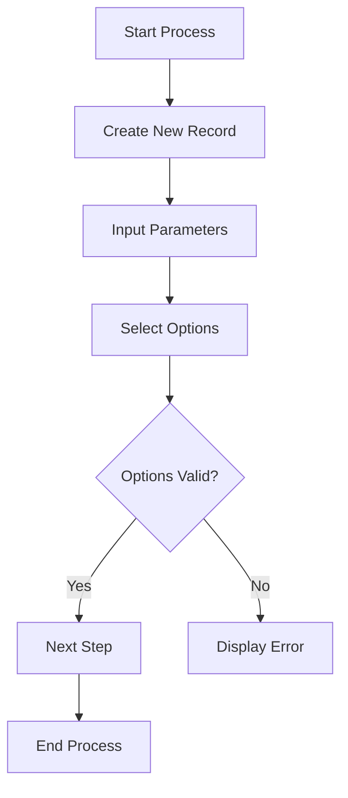

---
description:
  Business scope generation guide and template for Greenova modules, including
  structure, use cases, and data model.
mode: general

tools:
  - file_search
  - read_file
  - insert_edit_into_file
  - semantic_search
  - get_errors
---

<!-- filepath: /workspaces/greenova/.github/prompts/business-scope.prompt.md -->

# Greenova Business Scope Generation Guide

## Module Definition Instructions

When requesting a business scope, provide the following information:

- Module name (e.g., "Environmental Auditing", "Compliance Tracking")
- Primary purpose of the module
- Key stakeholders who will use the module
- Main business problems it solves

## Document Structure Requirements

### Title and Overview

Generate a clear, concise title for the module followed by an overview
paragraph that:

- Explains the module's purpose in the context of environmental management
- Highlights its primary functions
- States its overall business value

```markdown
# [Module Name] Module

## Overview

The Greenova [Module Name] Module provides [primary function description] for
organizations to [key capability]. This module facilitates [main benefits],
[secondary benefits], and [tertiary benefits].
```

### Business Scope Section

Define 4-6 critical business needs addressed by the module using bullet points.
Each need should:

- Start with a bold heading (2-3 words)
- Include a brief explanation (1 sentence)

```markdown
## Business Scope

The [module name] addresses several critical business needs:

- **Regulatory Compliance**: Ensures adherence to environmental laws,
  regulations, and standards
- **Risk Management**: Identifies, assesses, and mitigates environmental
  compliance risks
```

### Key Use Cases

Describe 3-5 primary use cases for the module, each containing:

- Numbered heading with use case name
- 2-3 sentence description explaining the workflow
- Focus on user roles and system interactions

```markdown
## Key Use Cases

### 1. Compliance Verification

Environmental managers use the [module] to verify that operations comply with
relevant environmental mechanisms. The system automatically pulls obligations
from the register based on selected mechanisms, creating a structured
evaluation framework.
```

### Process Flow

Create a Mermaid flowchart that illustrates the complete workflow, including:

- Clear start and end points
- Decision points with branches
- Status transitions
- User interaction points
- System automations



### Data Model

Create a table showing the key data entities with columns for:

- Entity name
- Description
- Relationship to other entities

```markdown
## Data Model

The [module name] uses the following key data entities:

| Entity | Description                | Relationship          |
| ------ | -------------------------- | --------------------- |
| Record | Top-level record (XX-XXXX) | Multiple entries      |
| Entry  | Individual item            | Belongs to one record |
```

### Status Management

Define the status tracking system for the module including:

- Status values for each entity type
- Automated status transitions
- Business rules for status changes

### Technical Implementation

Provide pseudocode that outlines the core functionality using:

- Functions with descriptive names
- Input and output parameters
- Business logic in plain language
- Validation rules and error handling
- Clear module organization with comments

### Integration Points

List 3-5 integration points with other Greenova modules or systems.

### User Interface Requirements

Outline the UI requirements focusing on user workflow and interactions.

### Accessibility Considerations

Include specific accessibility considerations that ensure WCAG 2.1 AA
compliance.

## Technical Constraints

The generated business scope must align with Greenova's technical stack:

- Django 5.2 backend with Python 3.12.9
- PicoCSS as primary frontend framework
- django-hyperscript for simple interactions
- django-htmx for AJAX functionality
- Accessible interfaces meeting WCAG 2.1 AA standards

## Output Format

Generate the final business scope document in GitHub Flavored Markdown format.
