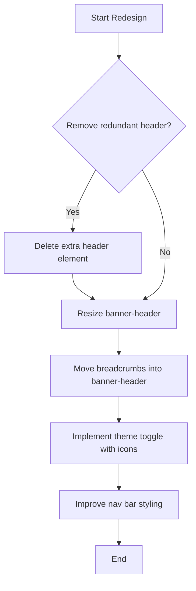
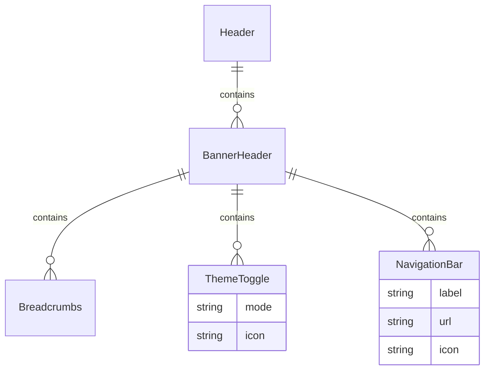

---
description:
  GitHub issue template for Greenova, including project fields, structure, and
  automation instructions.
mode: agent

tools:
  - github
  - file_search
  - read_file
  - insert_edit_into_file
  - semantic_search
  - get_errors
---

<!-- filepath: /workspaces/greenova/.github/prompts/github-issue.prompt.md -->

# GitHub Issue Template for Greenova Project

## Project Fields (for GitHub Project Automation)

Prompt: please generate the github issue including pseudocode to help plan out
resolution of issue, mermaid diagrams (flow for workflows and erds for database
and data relationships,) and also use the current files for additional context
from the project in body to visually provide context by updating
`github_issue.fish` and then run in fish terminal, if labels not found, please
create label with gh-cli `gh label create` command. The current script format
in `github_issue.fish`

- **Title**: `PVTF_lAHOCchfJ84A3c00zgslf0M` (ProjectV2Field)
- **Assignees**: `PVTF_lAHOCchfJ84A3c00zgslf0Q` (ProjectV2Field)
- **Status**: `PVTSSF_lAHOCchfJ84A3c00zgslf0U` (ProjectV2SingleSelectField)
  Options: Sort, Set In Order, Shine, Standardize, Sustain, Safety, Spirit
- **Labels**: `PVTF_lAHOCchfJ84A3c00zgslf0Y` (ProjectV2Field)
- **Linked pull requests**: `PVTF_lAHOCchfJ84A3c00zgslf0c` (ProjectV2Field)
- **Milestone**: `PVTF_lAHOCchfJ84A3c00zgslf0g` (ProjectV2Field)
- **Repository**: `PVTF_lAHOCchfJ84A3c00zgslf0k` (ProjectV2Field)
- **Reviewers**: `PVTF_lAHOCchfJ84A3c00zgslf0w` (ProjectV2Field)
- **Parent issue**: `PVTF_lAHOCchfJ84A3c00zgslf00` (ProjectV2Field)
- **Sub-issues progress**: `PVTF_lAHOCchfJ84A3c00zgslf04` (ProjectV2Field)
- **Priority**: `PVTSSF_lAHOCchfJ84A3c00zgslf9E` (ProjectV2SingleSelectField)
  Options: P1, P2, P3, P4
- **Size**: `PVTSSF_lAHOCchfJ84A3c00zgslf9I` (ProjectV2SingleSelectField)
  Options: XS, S, M, L, XL
- **Effort**: `PVTF_lAHOCchfJ84A3c00zgslf9M` (ProjectV2Field) Options: Number
  (1-8)
- **Start date**: `PVTF_lAHOCchfJ84A3c00zgslf9Q` (ProjectV2Field)
- **End date**: `PVTF_lAHOCchfJ84A3c00zgslf9U` (ProjectV2Field)

- For single select fields (Status, Priority, Size), use the option names as
  shown above.
- For the Effort field, use a number between 1 and 8.
- Use the Field ID when automating or scripting issue creation with the GitHub
  API or CLI.

---

## Issue Type

{Choose one: Bug, Feature Request, Enhancement, Documentation, Test,
Refactoring}

## Issue Details

### Title

Create a concise title following the format `{type}: {summary}`

For bugs, use: `bug: {brief summary of the issue}` Example:
`bug: Dashboard fails to load environmental metrics with project filter`

### Description

A clear summary of the issue or feature request. For bugs, this should match
the bug report summary.

### Current Behavior

For bugs:

- What currently happens (from the "Actual Result" in bug report)
- Include specific error messages if applicable
- Reference error details from the bug report

For features/enhancements:

- Describe current limitations or missing functionality

### Expected Behavior

What should happen instead. For bugs, this comes directly from the "Expected
Result" section of the bug report.

### Steps to Reproduce (for bugs)

1. {First Step}
2. {Second Step}
3. {Additional Steps...}

Copy these directly from the bug report's "Steps to Reproduce" section.

### Environment Details

From the bug report's "Environment" section:

- **Application Version**: {Version number}
- **Operating System**: {OS and version}
- **Browser**: {Browser name and version, if applicable}
- **Device**: {Device type/model}

### Technical Context

- **Django Version**: 5.2
- **Python Version**: 3.12.9
- **Frontend Technologies**: PicoCSS, django-hyperscript, django-htmx
- **Database**: SQLite3 (development)
- **Affected Module/App**: {Specify the Django app affected}
- **Template Type/File**: {Specify if Jinja2 (.jinja) or DTL (.html) and the
  affected template file}
- **Template Engine**: {Jinja2 or Django Template Language}

### Pseudocode

Include pseudocode to outline the logic or flow of the issue. For example:

```pseudocode
FUNCTION redesignNavigationBarAndHeader()
    removeRedundantHeader()
    resizeBannerHeader()
    moveBreadcrumbsToBannerHeader()
    implementThemeToggleWithIcons()
    improveNavBarStyling()
END FUNCTION
```

### Mermaid Flow Diagram

Provide a flowchart to visualize workflows or processes. For example:



### ERD Diagram

Include an Entity-Relationship Diagram (ERD) to show data relationships with
data in models.py. For example:



### Logs and Error Details

- **Error Messages**: {Exact error text from bug report}
- **Traceback Summary**: {Brief summary of the most relevant parts of the
  traceback}
- **Reference**: Detailed traceback available in original bug report

### Impact Assessment

- **Severity**: {Critical/High/Medium/Low} (from bug report)
- **User Impact**: {Description of how users are affected}
- **Frequency**: {How often the issue occurs, from bug report}

### Visual Workflow

Reference any screenshots or videos from the bug report.

### Acceptance Criteria

- [ ] Issue is resolved with no regressions
- [ ] Documentation is updated if necessary
- [ ] Tests are added/updated to cover the fix
- [ ] WCAG 2.1 AA compliance maintained
- [ ] {Additional criteria specific to this issue}

### Related Issues/PRs

Link any related issues or pull requests mentioned in the bug report.

### Workarounds

Document any temporary solutions mentioned in the bug report.

## Labels

Suggested labels (select all that apply):

- **Primary label**: `bug`, `enhancement`, `documentation`, etc.
- **Component labels**: `django`, `javascript`, `css`, `ui`, `database`, etc.
- **Priority labels**: `priority-critical`, `priority-high`, `priority-medium`,
  `priority-low`
- **Type labels**: `testing`, `refactoring`, `ux`, etc.

### Available Labels

- **bug**: Something isn't working
- **documentation**: Improvements or additions to documentation
- **duplicate**: This issue or pull request already exists
- **enhancement**: New feature or request
- **good first issue**: Good for newcomers
- **help wanted**: Extra attention is needed
- **invalid**: This doesn't seem right
- **question**: Further information is requested
- **wontfix**: This will not be worked on
- **javascript**: JavaScript-related issues
- **django**: Django framework issues
- **eslint**: ESLint configuration issues
- **makefile**: Makefile-related issues
- **docker**: Docker/Devcontainer issues
- **css**: CSS/styling issues
- **ui**: User interface issues
- **refactoring**: Code refactoring
- **ux**: User experience issues
- **pytest**: Pytest-related issues
- **selenium**: Selenium-related issues
- **testing**: General testing issues
- **authentication**: Authentication issues
- **django-allauth**: Issues related to django-allauth
- **database**: Database-related issues
- **accessibility**: Accessibility concerns
- **security**: Security concerns

---

**Reminder**: Please ensure all code contributions follow our development
practices:

- Test-driven development
- WCAG 2.1 AA accessibility standards
- Proper model relationships and constraints
- Class-based views with minimal mixins
- Type annotations with mypy
