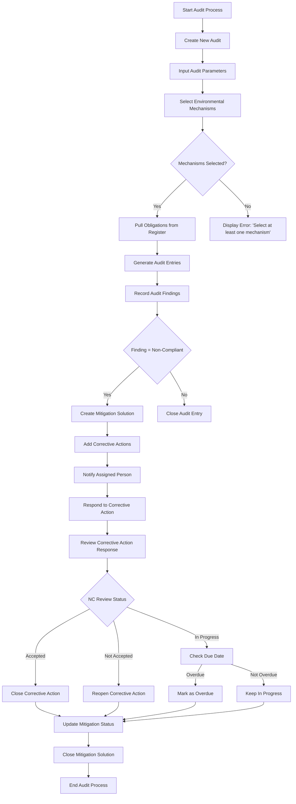

# Environmental Auditing Module

## Overview

The Greenova Environmental Auditing Module provides a structured framework for
organizations to systematically evaluate compliance with environmental
regulations and standards. This module facilitates the identification of
effective environmental management practices, areas for improvement in
environmental compliance, and assessment of potential environmental risks.

## Business Scope

The auditing module addresses several critical business needs:

- **Regulatory Compliance**: Ensures adherence to environmental laws,
  regulations, and standards
- **Risk Management**: Identifies, assesses, and mitigates environmental
  compliance risks
- **Continuous Improvement**: Tracks corrective actions and their
  implementation status
- **Performance Monitoring**: Provides metrics on environmental compliance
  performance
- **Documentation**: Maintains comprehensive records of audit findings and
  remediation efforts

## Key Use Cases

### 1. Compliance Verification

Environmental managers use the auditing module to verify that operations comply
with relevant environmental mechanisms. The system automatically pulls
obligations from the register based on selected mechanisms, creating a
structured evaluation framework.

### 2. Non-Compliance Management

When non-compliances are identified, the system facilitates the creation and
tracking of mitigation solutions and corrective actions. It manages the
workflow between the audit team and responsible parties to ensure proper
resolution.

### 3. Risk Assessment

The audit process includes risk classification of findings (Minor, Major,
Critical), allowing organizations to prioritize responses based on potential
environmental impact.

### 4. Corrective Action Tracking

The module provides a complete lifecycle management system for corrective
actions, including assignment, response collection, review, and closure
verification.

## Process Flow

The following flowchart illustrates the complete audit process workflow:



## Data Model

The auditing module uses the following key data entities:

| Entity      | Description                    | Relationship           |
| ----------- | ------------------------------ | ---------------------- |
| Audit       | Top-level record (Aud-XXXX)    | Multiple audit entries |
| Audit Entry | Compliance check of obligation | Belongs to one audit   |
| Mitigation  | Non-comp plan (Mit-XXXX)       | Related to audit entry |
| Corrective  | Remediate task (CA-XXXX)       | Belongs to mitigation  |

## Status Management

The system maintains status tracking across all records:

- **Audit Entry Status**: Open, Closed, In Progress, Overdue, Action Required
- **Corrective Action Status**: Open, Closed, In Progress, Overdue
- **Mitigation Status**: Open, Closed, Action Required

Status transitions are automated based on business rules and audit findings.

## Technical Implementation

The following pseudocode outlines the core functionality of the auditing
module:

```pseudo
// Greenova Auditing Module Pseudocode

// ----- AUDIT SETUP MODULE -----

function createNewAudit():
    // Generate unique audit ID
    auditId = "Aud-" + generateUniqueNumericSequence(4)

    // Set basic audit parameters
    auditDate = getCurrentDate()
    auditUser = getCurrentUser()

    // Display form for collecting audit context information
    displayAuditSetupForm()

    return auditId, auditDate, auditUser

function selectEnvironmentalMechanisms():
    // Allow user to select one or multiple mechanisms
    selectedMechanisms = displayMechanismSelectionInterface()

    // Validate at least one mechanism is selected
    if isEmpty(selectedMechanisms):
        displayError("Please select at least one environmental mechanism")
        return null

    return selectedMechanisms

function initializeAudit(auditId, selectedMechanisms):
    // Pull relevant obligations from obligations register
    obligationsToAudit = []

    foreach mechanism in selectedMechanisms:
        relatedObligations = queryObligationsByMechanism(mechanism)
        obligationsToAudit.extend(relatedObligations)

    // Create audit entries for each obligation
    auditEntries = []

    foreach obligation in obligationsToAudit:
        entry = {
            "auditId": auditId,
            "date1": getCurrentDate(),
            "obligationId": obligation.uniqueId,
            "obligationText": obligation.text,
            "evidence": "",
            "finding": "",  // Options: C, CM, NC, ND, NA
            "riskSignificance": "",  // Options: Minor, Major, Critical, OFI, NA
            "determination": "",
            "attachments": [],
            "status": "Open"
        }
        auditEntries.append(entry)

    return auditEntries

// ----- AUDIT EXECUTION MODULE -----

function recordAuditFindings(auditEntry):
    // Collect evidence and findings for an audit entry
    evidence = collectUserInput("evidence")
    finding = collectUserSelection(["C", "CM", "NC", "ND", "NA"])
    riskSignificance = collectUserSelection(["Minor", "Major", "Critical", "OFI", "NA"])
    determination = collectUserInput("determination")
    attachments = collectAttachments(maxCount=5, maxSizePerFile=5)

    // Update audit entry
    auditEntry.evidence = evidence
    auditEntry.finding = finding
    auditEntry.riskSignificance = riskSignificance
    auditEntry.determination = determination
    auditEntry.attachments = attachments

    // Update status based on finding
    if finding in ["NC", "ND", "NA"]:
        auditEntry.status = "Closed"

    return auditEntry

// ----- MITIGATION SOLUTION MODULE -----

function createMitigationSolution(auditEntry):
    // Check if audit finding requires mitigation
    if auditEntry.finding != "NC":
        return null

    // Create mitigation solution
    mitigationId = "Mit-" + generateUniqueNumericSequence(4)
    date2 = getCurrentDate()
    user = getCurrentUser()

    mitigationSolution = {
        "mitigationId": mitigationId,
        "date2": date2,
        "user": user,
        "auditDetermination": auditEntry.determination,  // Display only
        "correctiveActions": [],
        "status": "Open"
    }

    return mitigationSolution

function addCorrectiveAction(mitigationSolution):
    // Generate corrective action ID
    caId = "CA-" + generateUniqueNumericSequence(4)

    // Collect corrective action details
    actionText = collectUserInput("corrective action", maxLength=512)
    personAssigned = selectUserFromDomain()
    date3 = selectDueDate()
    riskClassification = collectUserSelection(["Low", "Medium", "High"])

    correctiveAction = {
        "caId": caId,
        "actionText": actionText,
        "personAssigned": personAssigned,
        "date3": date3,
        "riskClassification": riskClassification,
        "response": "",
        "responseDate": null,
        "responseAttachments": [],
        "ncReview": "In Progress",
        "ncReviewDate": null
    }

    mitigationSolution.correctiveActions.append(correctiveAction)

    // Send notification to assigned person
    sendNotificationToUser(personAssigned,
                          "New corrective action assigned",
                          caId)

    return correctiveAction

// ----- CORRECTIVE ACTION RESPONSE MODULE -----

function respondToCorrectiveAction(correctiveAction):
    // Record response from assigned person
    date4 = getCurrentDate()
    response = collectUserInput("corrective action response")
    attachments = collectAttachments(maxCount=5, maxSizePerFile=5)

    correctiveAction.response = response
    correctiveAction.responseDate = date4
    correctiveAction.responseAttachments = attachments

    // Notify the original CA creator for review
    sendNotificationToUser(correctiveAction.creator,
                          "Corrective action response submitted",
                          correctiveAction.caId)

    return correctiveAction

function reviewCorrectiveActionResponse(correctiveAction):
    // CA creator reviews the response
    ncReview = collectUserSelection(["Accepted", "Not Accepted", "Redundant", "In Progress"])
    date5 = getCurrentDate()

    correctiveAction.ncReview = ncReview
    correctiveAction.ncReviewDate = date5

    // Update status based on review
    updateCorrectiveActionStatus(correctiveAction)

    return correctiveAction

// ----- STATUS MANAGEMENT MODULE -----

function updateCorrectiveActionStatus(correctiveAction):
    if correctiveAction.ncReview == "In Progress" or correctiveAction.ncReview == "Not Accepted":
        correctiveAction.status = "Open"
    elif correctiveAction.ncReview == "Accepted":
        correctiveAction.status = "Closed"

    if correctiveAction.ncReview == "In Progress":
        if getCurrentDate() > correctiveAction.date3:
            correctiveAction.status = "Overdue"
        else:
            correctiveAction.status = "In Progress"

    return correctiveAction

function updateMitigationStatus(mitigationSolution):
    // Check if any CA is not assigned
    hasUnassignedCA = false
    allAccepted = true

    foreach ca in mitigationSolution.correctiveActions:
        if ca.personAssigned == null:
            hasUnassignedCA = true
        if ca.ncReview != "Accepted":
            allAccepted = false

    if hasUnassignedCA:
        mitigationSolution.status = "Action Required"

    // Update parent audit entry if all CAs accepted
    if allAccepted and !isEmpty(mitigationSolution.correctiveActions):
        parentAuditEntry = findAuditEntryByDetermination(mitigationSolution.auditDetermination)
        if parentAuditEntry and parentAuditEntry.finding == "NC":
            parentAuditEntry.finding = "CM"
            parentAuditEntry.status = "Closed"
            mitigationSolution.status = "Closed"

    return mitigationSolution

// ----- UTILITY FUNCTIONS -----

function generateUniqueNumericSequence(length):
    // Generate a numeric sequence of specified length
    sequence = ""
    for i = 0 to length-1:
        sequence += randomDigit()
    return sequence

function collectAttachments(maxCount, maxSizePerFile):
    // Implementation for collecting file attachments
    attachments = []
    while countAttachments < maxCount:
        file = promptUserForFile()
        if file and getFileSize(file) <= maxSizePerFile:
            attachments.append(file)
    return attachments
```

## Integration Points

The auditing module integrates with:

1. **Obligation Register**: Pulls obligation data based on selected
   environmental mechanisms
2. **User Management System**: For assigning corrective actions and tracking
   responsibilities
3. **Notification System**: Alerts users about assigned tasks and status
   changes
4. **Document Management**: Stores evidence and supporting documentation

## User Interface Requirements

The module requires interfaces for:

- Creating and configuring audits
- Selecting environmental mechanisms
- Recording findings with evidence
- Creating and tracking mitigation solutions
- Managing corrective actions workflow
- Reviewing and approving responses

## Accessibility Considerations

All interfaces comply with WCAG 2.1 AA standards, ensuring:

- Proper heading structure
- Adequate color contrast
- Keyboard navigability
- Screen reader compatibility
- Descriptive form labels and error messages
